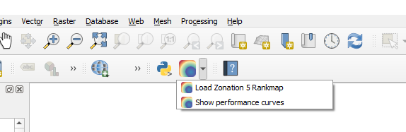
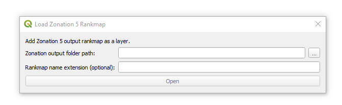
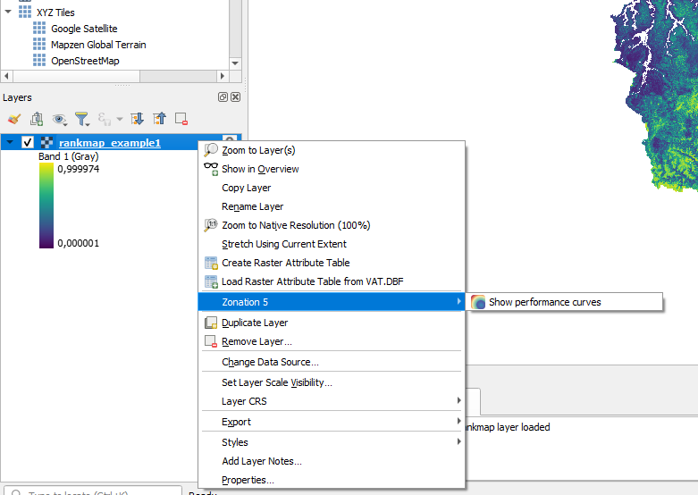
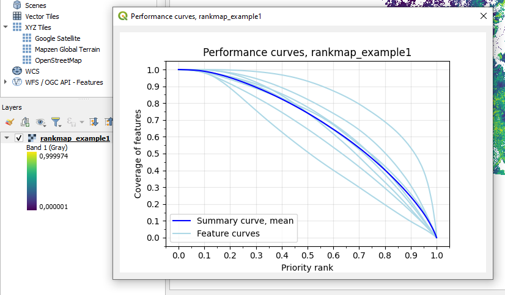

# Zonation 5 Rankmap Loader QGIS plugin

This QGIS plugin adds Zonation 5 output rankmap as layer and shows associated performance curves.

## Installation
1. Download this repository as a zip-file ("<> Code" button, Local, Download ZIP)
2. Open QGIS, select "Plugins" > "Manage and Install Plugins..."
3. Select "Install from ZIP", select downloaded zip-file and click "Install Plugin", accept warning

## How to use
There is "Load Zonation 5 Rankmap" button with Zonation icon in QGIS toolbar.

Selecting "Load Zonation 5 Rankmap" takes you to a window where you can select your Zonation 5 output folder and give (optional) extension for its name. When "Open" button is clicked, rankmap is added to QGIS as as a layer.

To view performance curves, select "Show performance curves" from QGIS toolbar or right click layer name in Layers panel and select "Zonation 5" > "Show performance curves" from the context menu.

You can add multiple Zonation 5 outputs at the same time. Performance curves window will show curves for currently active layer (if it has associated data added from output directory). You can view performance curves from one output at a time.

